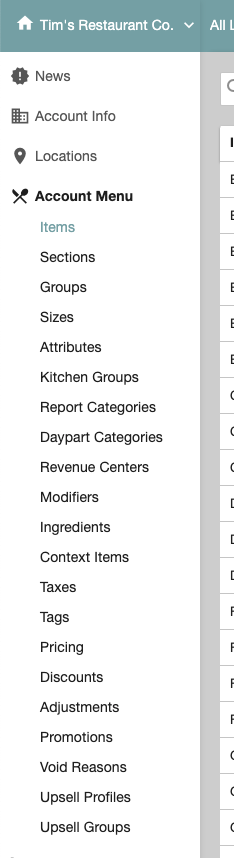
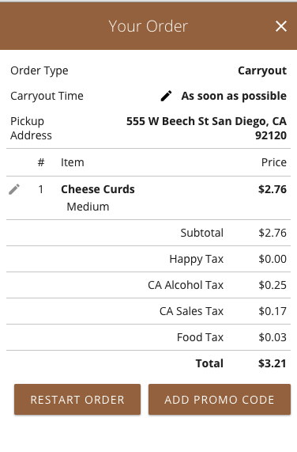
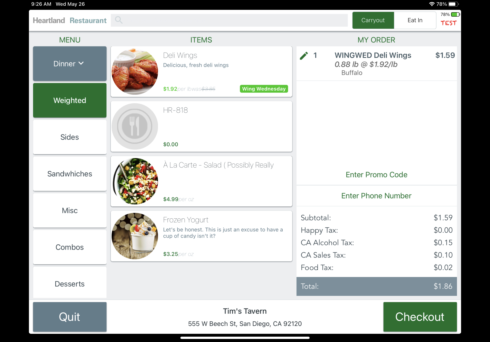
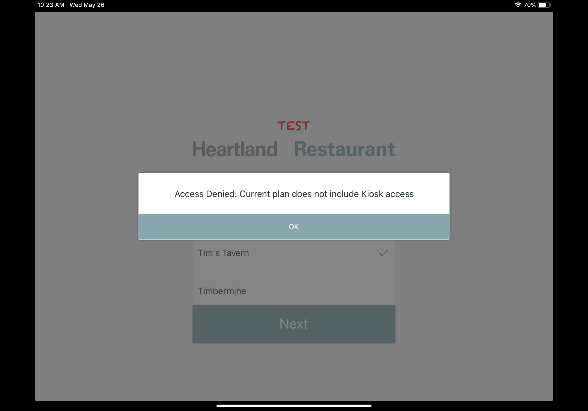
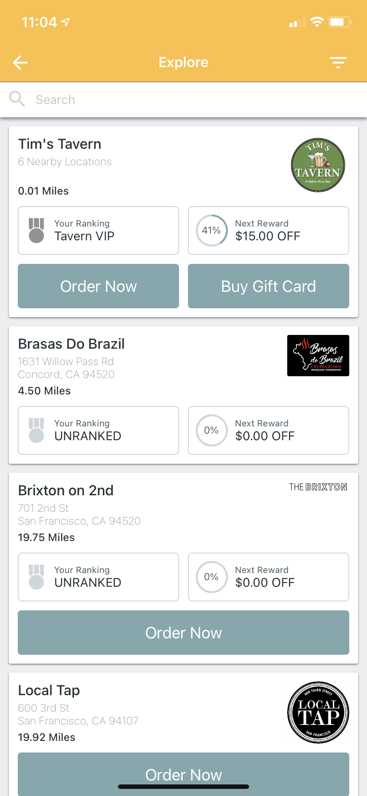

# Adding a feature flag: Promotions & App Access

**Purpose**: Show techniques of using Launch Darkly (LD) & current in-house LD frameworks for wrapping a feature flag.

In the following examples, we will show the work done for:
- [HR-2667](https://heartlandpos.atlassian.net/browse/HR-2667) which entailed wrapping Promotions features using the [promo-access](https://app.launchdarkly.com/heartland-restaurant/test/features/promo-access/targeting) flag in LD
- [HR-2666](https://heartlandpos.atlassian.net/browse/HR-2666) which entailed restricting app access using the [kiosk-access](https://app.launchdarkly.com/heartland-restaurant/test/features/kiosk-access/targeting) and [guest-access](https://app.launchdarkly.com/heartland-restaurant/test/features/guest-access/targeting) flags in LD


> :warning: **PLEASE NOTE** :warning: 
> **These in-house frameworks are _NOT_ set in stone! We may find we need to add, edit, remove, or even completely change how this works. These in-house frameworks were written with the intention of reusability but we may have not captured all cases**

# Contents
Frontend
- [Angular](#angular) [web_backend] `AdminPortal`
- [React](#react) [serverless] `OnlineOrdering`
- [React Native](#react-native) [serverless] `GuetApp, Kiosk, CustomerDisplay`

Backend
- [PHP](#php) [web_backend] `PHP Api`
- [Node.js](#nodejs) [serverless] `ConsumerAPI, OLOAPI, MB-OPS, MB-PublicAPI, etc..`
  
# Angular

**Task**: Conditionally show Promotions page based on `promo-access`



Here is the code snippet for Admin Portal SideBar:
`app/src/views/back/index.html`

```html
<li ng-show="LDFlags.promoAccess">
	<a ui-sref="root.menu.promotions">
		{{ 'common:promotions' | i18next }}
	</a>
</li>
```

`LDFlags` comes from [LaunchDarklyService](#launchdarklyservice). `LDFlags` are a global store of Launch Darkly flags on the `$rootScope`

> LD does not have an Angular SDK, so we must utilize their [JavaScript SDK](https://docs.launchdarkly.com/sdk/client-side/javascript) and build our own Angular LD services

### LaunchDarklyService

In-house framework for managing initalization, identification, and flags. [Implementation here](https://github.com/MobileBytes/web_backend/blob/5622384ad2056f2ea3d3c51253e55a60acf33767/app/src/views/back/services.js#L531)

You can also evaluate flags w/LDClient in controllers
```js
let ldUser = await LaunchDarklyService.getLDUser();
let ldClient = LaunchDarklyService.getClient();
let someFlag = ldClient.variation('some-flag', ldUser);
```

### LD Docs
[LD JavaScript SDK](https://docs.launchdarkly.com/sdk/client-side/javascript)

[LD JavaScript API DOCS](https://launchdarkly.github.io/js-client-sdk)

# React

**Task**: Conditionally show `+ Add Promo` button based on `promo-access`



Here is the code snippet for OLO Cart:
`online_ordering/src/containers/CartContainer/index.js`
```js
get renderAddPromo() {
	if (!this.props.flags.promoAccess) {
		return false;
	}
	...other conditionals...
}
```
### LaunchDarkly Identifier
A logical functional component which handles initalizing & identifiying LD client.

```js
<LDIdentifier/>
```
[Implementation here](https://github.com/MobileBytes/serverless/blob/dd0a9a5d6dd52f78d53602ee292183dc66a08157/apps/packages/online_ordering/src/launchDarkly/LDIdentifier.ts)

### LD Docs
[LD React SDK](https://docs.launchdarkly.com/sdk/client-side/react/react-web)

[LD React API DOCS](https://launchdarkly.github.io/react-client-sdk/)

# React Native

**Task**: Conditionally show `+ Enter Promo Code` button based on `promo-access`



Here is the code snippet for Kiosk Cart:
`Kiosk/src/containers/CartContainer.js`
```js
function mapStateToProps(state) {
	const getPromoAccess = launchDarkly.getFlag('promo-access');
	return {
		promoAccess: getPromoAccess(state)
	};
}
```
and usage of flag:
`Kiosk/src/components/Cart.js`
```js
renderFooter() {
	const { promoAccess } = this.props;
	...
	return (
		...
		{promoAccess && (
			<View>
				<MaterialButton>Enter Promo Code</MaterialButton>
			</View>
		)}
		...
	);
}
```

> LD does not have as mature of SDK for React Native, as React, so we must utilize build some of our own React Native LD services

### Launch Darkly Slice
A shared redux slice that stores launch darkly flags, keys, and selectors for use across React Native apps.

[Implementation here](https://github.com/MobileBytes/serverless/blob/1d812a78d97fca3f5d2634100729079532d7796c/apps/packages/shared/store/slices/launchDarkly/index.ts)


### Launch Darkly Saga
A *base* shared redux saga that handles common initialization, identification, and watches for flag changes. React Native apps will extend this saga by determing when to identify. Handles dispatching flag updates to [Launch Darkly Slice](#launch-darkly-slice)

[Implementation here](https://github.com/MobileBytes/serverless/blob/1d812a78d97fca3f5d2634100729079532d7796c/apps/packages/shared/store/sagas/launchDarkly.js)

### Launch Darkly Hooks
A library of React Native hooks that can be used w/functional components to fetch flags from [LD Slice](#launch-darkly-slice).

Example: 
```js
import { useFlag } from 'shared/hooks/launchDarkly';
function MyComponent() {
	let promoAccess = useFlag('promo-access');
	return (
		{promoAccess && <PromoComponent />}
	)
}
```
[Implementation here](https://github.com/MobileBytes/serverless/blob/878ba74be4170d527f081809baca99f7f25fd795/apps/packages/shared/hooks/launchDarkly.ts) 

### LD Docs

[LD React Native SDK](https://docs.launchdarkly.com/sdk/client-side/react/react-native)

[LD React Native API DOCS](https://launchdarkly.github.io/react-native-client-sdk/)

# PHP

**Task**: Conditionally allow login into Kiosk based on `kiosk-access`



Here is the code snippet for PHP API:
`application/controllers/api_v2/users.php`

```php
function device_location_kiosk_post() {
	...
	$kioskAccess = LDHelper::getInstance()->lVariation("kiosk-access", $locationId);
	if (!$kioskAccess) {
		$this->response(array(
			'status' => 'error',
			'msg' => "Access Denied: Current plan does not include Kiosk access"
		), 200);
	}
	...
}
```

### LDHelper
A utility helper to handle Launch Darkly flag evaluations easier. Rather than building the user for each variation request, we have methods to evaluate a flag for a `$locationId` or `$accountId`.

```php
$kioskAccess = LDHelper::getInstance()->lVariation("kiosk-access", $locationId);

// vs

$ldClient = LDClient::getInstance();
$objProfile = $this->ci->launchdarkly_model->getLocationProfile($locationID);
$ldUser = (new LDUserBuilder($objProfile['AccountNumber']))
			->name($objProfile['Name'])
			->custom([
				"PricingTierID" => $objProfile["PricingTierID"],
				...
			])->build();
$kioskAccess = $ldClient->variation("kiosk-access", $ldUser);
```

[Implementation here](https://github.com/MobileBytes/web_backend/blob/418bf2a00986d7e51b616cd967814f933cc8054f/application/libraries/launch-darkly/ldHelper.php) 

### LD Docs

[LD PHP SDK](https://docs.launchdarkly.com/sdk/server-side/php)

[LD PHP API DOCS](https://launchdarkly.github.io/php-server-sdk/)


# Node.js

**Task**: Conditionally show users on Guest App based on `guest-access`



Here is the code snippet for Consumer API:
`lambda/projects/consumer/explore/processList.js`

```js
let key = objLocation.AccountNumber;

return await context.ldClient.variation(
	'guest-access',
	{
		key,
		name: objLocation.Name,
		custom: { PricingTierID: RANK_ID_MAP[objLocation.PricingTierRank] }
	},
	false
);
```

### LDHelper
A utility helper to handle Launch Darkly flag evaluations easier. Rather than building the user for each variation request, we have methods to evaluate a flag for a `locationId` or `accountId`.

```js

let accountId = 1149;
let locationId = 1314;
let aViewer = { AccountID: accountId };
let lViewer = { LocationID: locationId };
let viewer = { AccountID: accountId, LocationID: locationId };

const myFlag = await new LDHelper(LDClient).lVariation('my-flag', locationId, false); // location variant
const myFlag = await new LDHelper(LDClient).aVariation('my-flag', accouontId, false); //account variant
const myFlag = await new LDHelper(LDClient).variation('my-flag', aViewer, false); //account variant
const myFlag = await new LDHelper(LDClient).variation('my-flag', lViewer, false); //location variant
const myFlag = await new LDHelper(LDClient).variation('my-flag', viewer, false); //location variant (location precedence)

const myFlag = await LDClient.variation('my-flag', ldUser, false); // this still works tooo

const myFlag = await new LDHelper(context.ldClient).lVariation('my-flag', locationId, false); // can also feed LDHelper context.ldClient
```
[Implementation here](https://github.com/MobileBytes/serverless/blob/7e33a25eb7d85aacde177ac802e43ee7d1b10d73/hrpos-lib/src/LaunchDarkly/helper.ts)

### LD Middleware
Custom LD middleware for ease of integration w/serverless projects using Middy.
```js
import { launchDarkly, LDClient } from 'hrpos-util/aws/lambda/middleware';
const handler = async function(event, context) {
	... bizLogic ...
	
	let accountNumber = '12345';
	let locationId = 1314;
	let accountId = 1149;

	let myFlag = await context.ldClient.variation('my-flag', { key: accountNumber }, false);
	// or
	let myFlag = await LDClient.variation('my-flag', { key: accountNumber }, false);

	let ldHelper = new LDHelper(context.ldClient);
	// or 
	let ldHelper = new LDHelper(LDClient); // LDClient an singleton export
	
	// Handles fetching LDProfile/LDUser for locationId
	let myFlag = ldHelper.lVariation('my-flag', locationId, false);

};
export default middy(handler).use(launchDarkly()); // <-- Now lambda has ldClient on context 😄 

```
[Implementation here](https://github.com/MobileBytes/serverless/blob/b68dbf7f37eb4e6db2c02c386f37ad703b8cb615/hrpos-util/src/aws/lambda/middleware/launchDarkly.ts) 

### LD Docs

[LD Node.js SDK](https://docs.launchdarkly.com/sdk/server-side/node-js)

[LD Node.js API DOCS](https://launchdarkly.github.io/node-server-sdk/)
