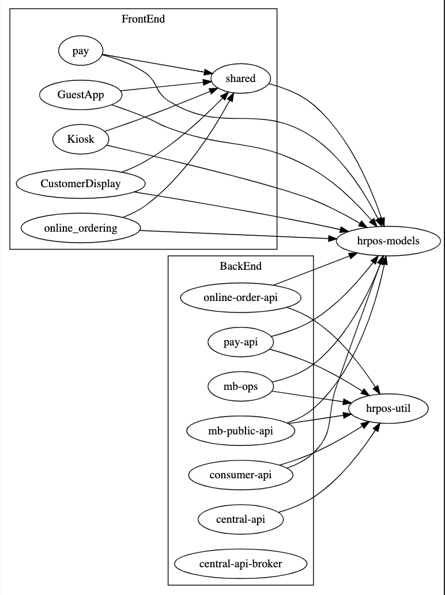

# DevOps Gameplan

## Issue

We have a growing issue of depenedcy hell that can lead to bugs and slows the development & delivery process.

## Proposal

Allow time to restructure code architecture and dockerize.

## Steps

1. Shared Packages \/ Poly Repos
    - Move common functionality into new repos: 
        - `hrpos-models`, `hrpos-utils`
2. Dockerize applications
    - Ease of local developemnt
    - Improved build process speed & reliability

## Advantages
1. Faster developemnt
2. More stable product \/ less bugs
3. Ease of onboarding

## Current Structure

## Proposed Structure

## Shiz works, why change?
- Looking at Current Structure, image a scenario in which changes are made to `online-order-api`. This has the potential to break everything upstream, including `consumer-api`, `mb-public-api`, `mb-ops`, `pay-api`, `central-api`
<!-- - In order to do a piece of work on `OnlineOrdering` application, you have to:
    - Run CoreTunnel
    - Run Serverless
    - Run React Bundler -->