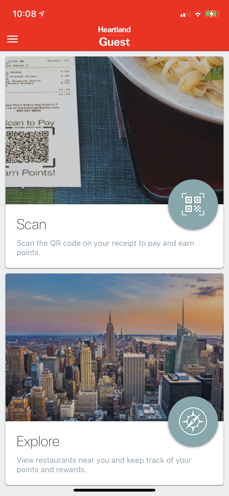
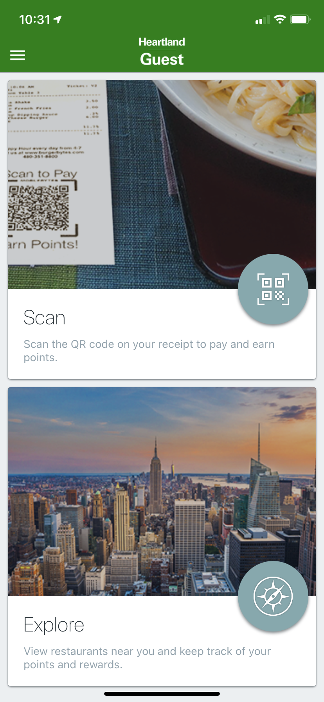

# API Versioning

## Problem
- We'd like to version our apis, but we cannot release a versioned API without breaking everyone else. In AWS API Gateway you cannot have a `basePath` of '/' along side another `basePath` (i.e. `/v2`). This means if we are to version our api, we must create two basePaths `/v1` and `/v2`. The issue is then that all apps hitting `/` will now receive a "Forbidden" response.

## Option 1 - Code Push Force Update

We can force a **mandatory** update that will apply itself immediately upon downloading the CodePush. If the user has a working internet connection, they will receive the update and the patch will immediately restart the app with the updated code. The potential downside to this is that if the user was in the middle of something the application would restart and they would loose whatever they had been doing. i.e. if they were in the middle of a S2P, they may never get successful confirmation or if they were in the middle of an order, they would loose their cart. If we go this route, best to do this with our release in the early AM.





```code-push release Heartland-POS/MBConsumer-iOS dist/ios '5.75' -m```


