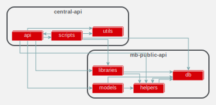
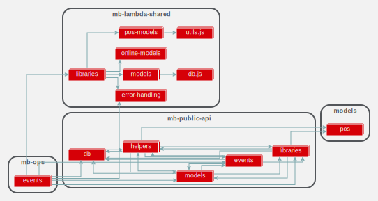
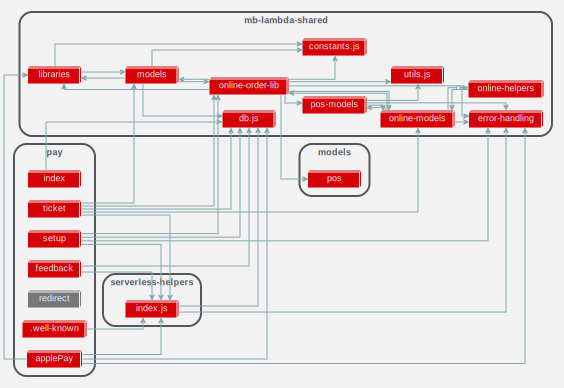
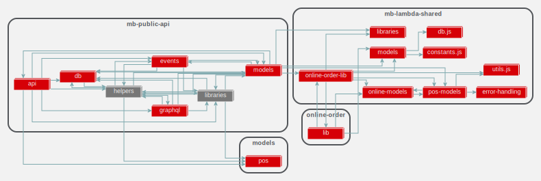
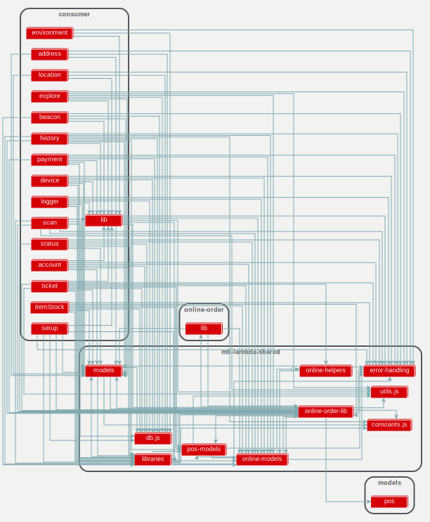
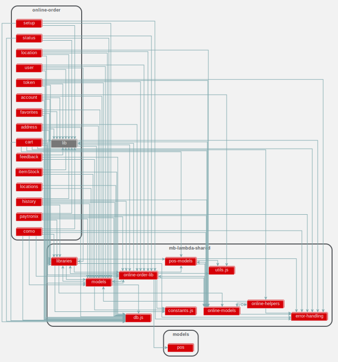

# High Level Dependency Graphs

The following are high level dependency graphs. Each node represents usage of some files in that folder. For example, `central-api` has a dependency on `mb-public-api`. `central-api` uses some files from the `mb-public-api/db` path. In order to break the `central-api`'s dependency on `mb-public-api`, we need to move `db` functionality into a shareable package. Then, have both `central-api` and `mb-public-api` use that shareable package. 

Steps to breaking up project dependencies:

1. **Find** inter-project dependencies :white_check_mark:
3. **Determine** where functionality belongs [`hrpos-utils`](../hrpos-util.md), [`hrpos-models`](../hrpos-models.md), or [`hrpos-lib`](../hrpos-lib.md)
3. **Move** shared dependency
4. **Remove** from external-dependency 
5. **Link** new dependency

Projects are sorted from top to botttom based on ease of breaking dependencies.

## central-api

## mb-ops

## pay-api

## mb-public-api

## consumer-api

## online-order

