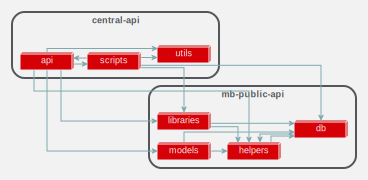

# High Level Dependency Graphs

The following are high level dependency graphs. Each node represents usage of some files in that folder. For example, `central-api` has a dependency on `mb-public-api`. `central-api` uses some files from the `mb-public-api/db` path. In order to break the `central-api`'s dependency on `mb-public-api`, we need to move `db` functionality into a shareable package. Then, have both `central-api` and `mb-public-api` use that shareable package. 

Steps to breaking up project dependencies:

1. **Find** inter-project dependencies :white_check_mark:
3. **Determine** where functionality belongs [`hrpos-utils`](../hrpos-util.md), [`hrpos-models`](../hrpos-models.md), or [`hrpos-lib`](../hrpos-lib.md)
3. **Move** shared dependency
4. **Remove** from external-dependency 
5. **Link** new dependency

Projects are sorted from top to botttom based on ease of breaking dependencies.

## central-api

| Project Dependency  | Complete |
| ------------- | ------------- |
| `mb-public-api`  | :ballot_box_with_check:  |

## mb-ops

| Project Dependency  | Complete |
| ------------- | ------------- |
| `mb-public-api`  | :ballot_box_with_check:  |
| `mb-lambda-shared`  | :ballot_box_with_check:  |
| `models`  | :ballot_box_with_check:  |

## pay-api

| Project Dependency  | Complete |
| ------------- | ------------- |
| `serverless-helpers`  | :ballot_box_with_check:  |
| `mb-lambda-shared`  | :ballot_box_with_check:  |
| `models`  | :ballot_box_with_check:  |

## mb-public-api

| Project Dependency  | Complete |
| ------------- | ------------- |
| `mb-lambda-shared`  | :ballot_box_with_check:  |
| `models`  | :ballot_box_with_check:  |
| `online-order`  | :ballot_box_with_check:  |

## consumer-api

| Project Dependency  | Complete |
| ------------- | ------------- |
| `mb-lambda-shared`  | :ballot_box_with_check:  |
| `models`  | :ballot_box_with_check:  |
| `online-order`  | :ballot_box_with_check:  |

## online-order

| Project Dependency  | Complete |
| ------------- | ------------- |
| `mb-lambda-shared`  | :ballot_box_with_check:  |
| `models`  | :ballot_box_with_check:  |
